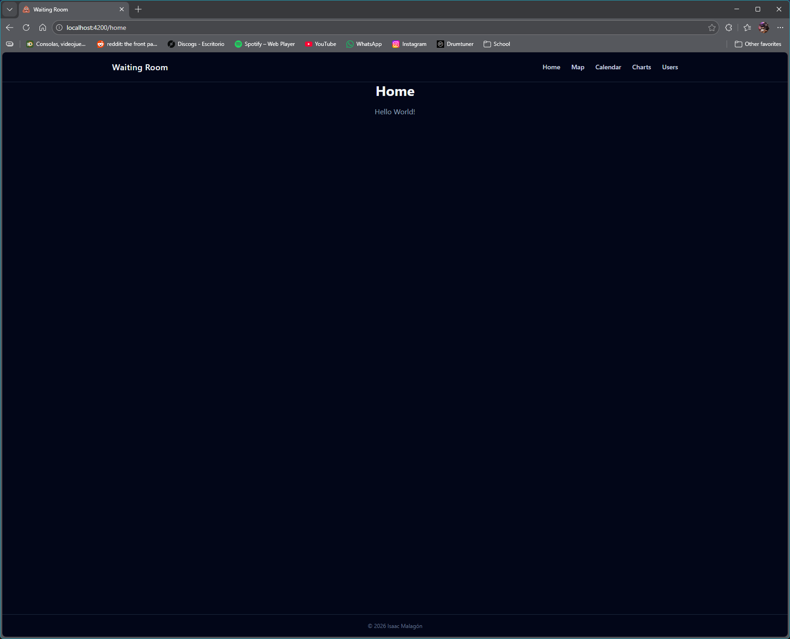
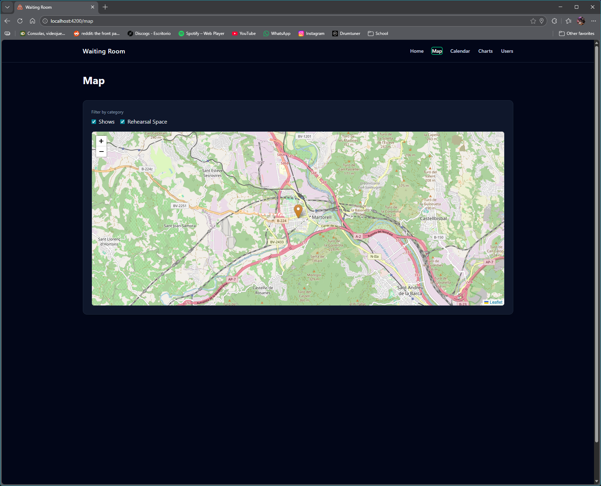
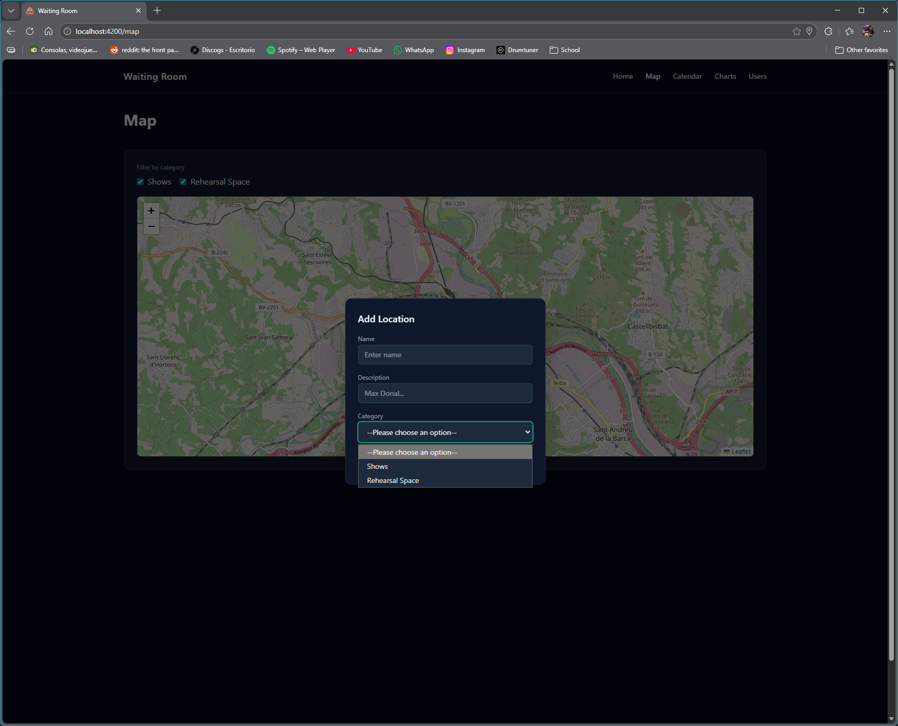
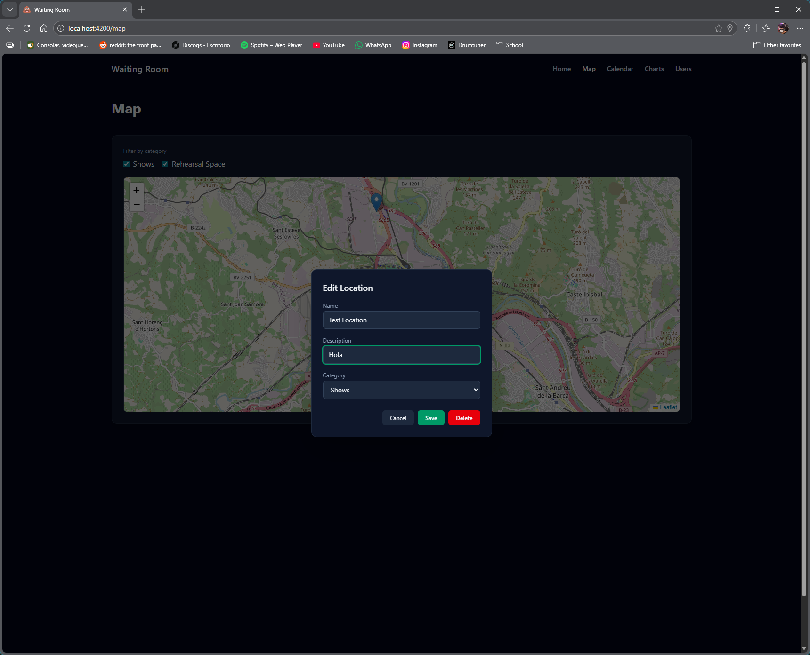
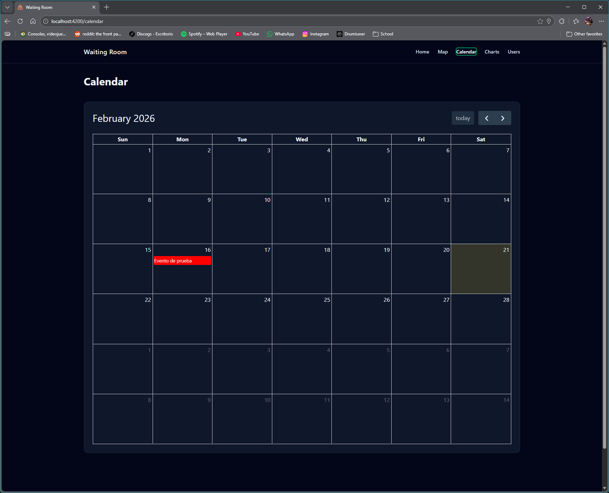
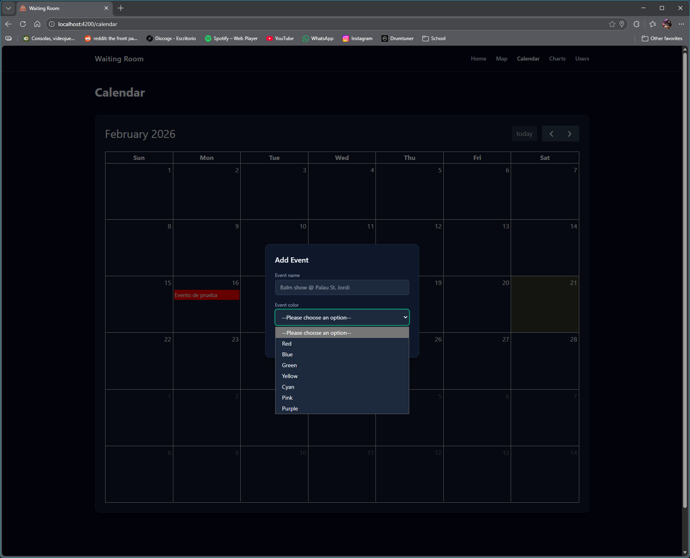
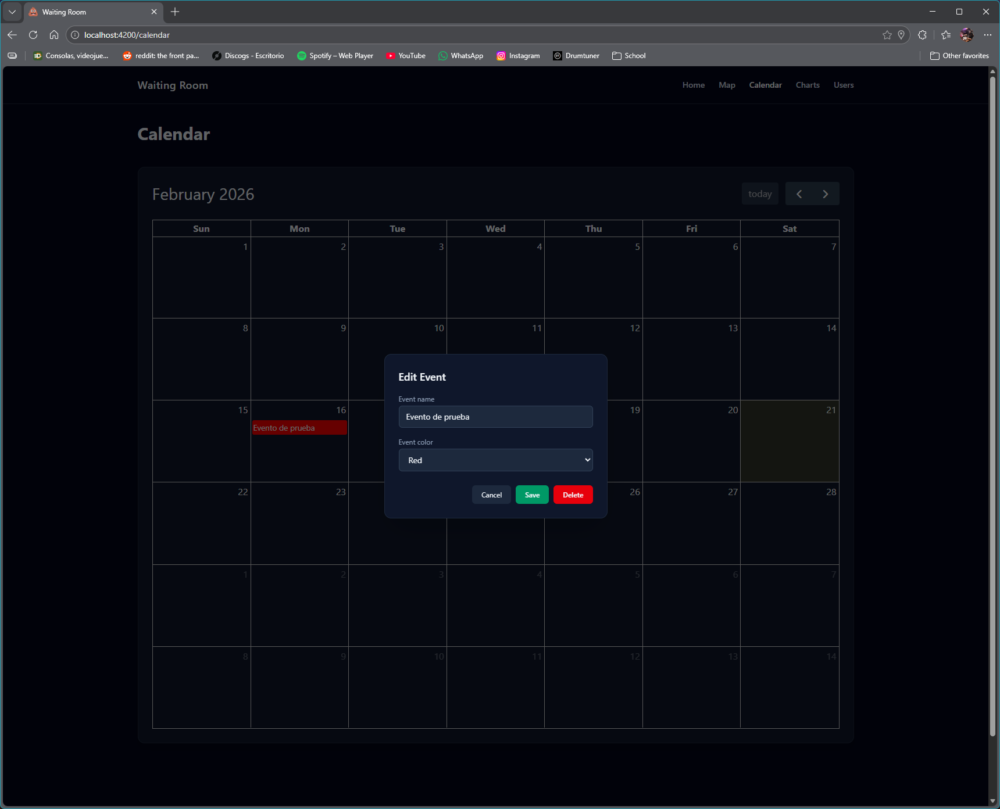
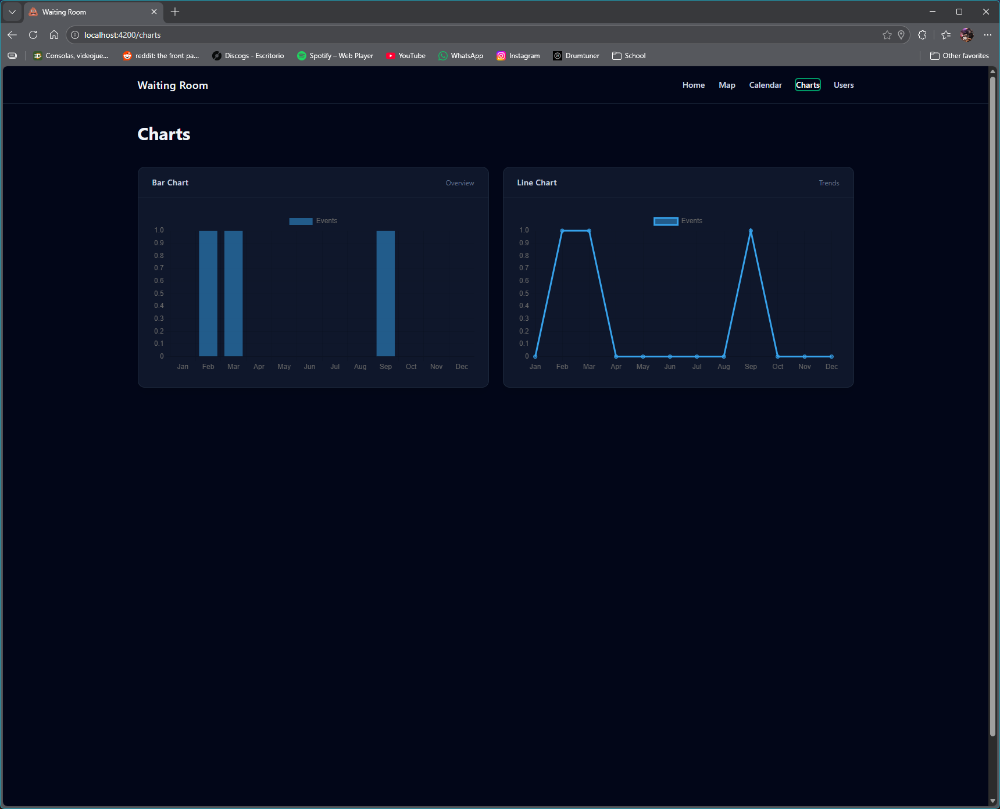
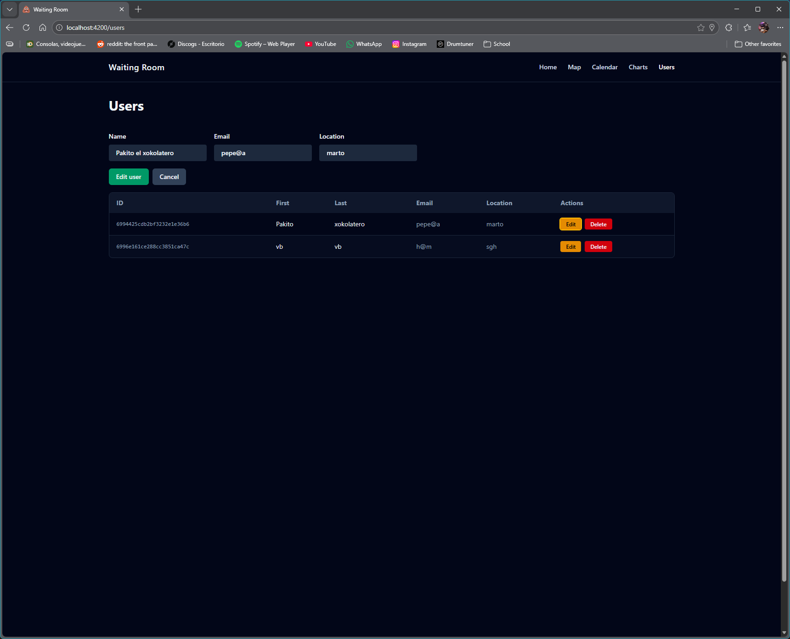

# Waiting Room - Musicians Platform Base

[](https://github.com/RichardLitt/standard-readme)


**Base platform for musicians built with Angular and NestJS, featuring event management, interactive maps, and user administration — foundation for a musicians' marketplace.**

---

## Table of Contents

- [Background](#background)
- [Technologies](#technologies)
- [Structure](#structure)
- [Installation](#installation)
- [API Configuration](#api-configuration)
- [Features](#features)
- [Usage](#usage)
- [Screenshots](#screenshots)
- [Maintainers](#maintainers)
- [Contributing](#contributing)
- [License](#license)

---

## Background

Waiting Room was developed as the foundational module set for 'Waiting Room' — a platform where musicians can organize their agenda, discover rehearsal spaces and venues near them, and connect with other artists.

The application explores Angular Signals, reactive state management, REST API integration with NestJS and MongoDB Atlas, interactive maps with Leaflet, data visualization with Chart.js and event management with FullCalendar.

---

## Technologies

### Frontend

- HTML5
- CSS3
- TypeScript 5
- Angular 21
- FullCalendar (event management)
- Leaflet (interactive maps)
- Chart.js (data visualization)
- Vitest (unit testing)

### Backend

- NestJS 11
- MongoDB Atlas
- Mongoose
- Jest (unit testing)

---

## Structure

```text
waiting-room/
├── frontend/                        # Angular application
│   ├── src/
│   │   └── app/
│   │       ├── components/          # UI components
│   │       │   ├── calendar/        # Event calendar (FullCalendar)
│   │       │   ├── charts/          # Event statistics (Chart.js)
│   │       │   ├── header/          # Navigation header
│   │       │   ├── home/            # Home page
│   │       │   ├── map/             # Interactive map (Leaflet)
│   │       │   └── users/           # User management
│   │       ├── models/              # Data models
│   │       │   ├── User.ts
│   │       │   ├── UserEvent.ts
│   │       │   └── UserLocation.ts
│   │       └── services/            # Application services
│   │           ├── apiservice.ts
│   │           ├── calendar-service.ts
│   │           ├── location-service.ts
│   │           └── user-service.ts
│   └── ...config files
│
└── backend/                         # NestJS API
    └── src/
        ├── events/                  # Events module
        │   ├── dto/
        │   ├── entities/
        │   ├── events.controller.ts
        │   └── events.service.ts
        ├── locations/               # Locations module
        │   ├── dto/
        │   ├── entities/
        │   ├── locations.controller.ts
        │   ├── locations.module.ts
        │   └── locations.service.ts
        └── users/                   # Users module
            ├── dto/
            ├── entities/
            ├── users.controller.ts
            ├── users.module.ts
            └── users.service.ts
```

---

## Installation

### Frontend

```bash
# Clone the repository
git clone https://github.com/your-username/waiting-room.git

# Navigate to the frontend folder
cd waiting-room

# Install dependencies
npm install

# Set up environment variables
# Edit src/environments/environment.ts with your API URL

# Start development server
ng serve

# Open http://localhost:4200 in your browser
```

### Backend

```bash
# Navigate to the backend folder
cd waiting-room-backend

# Install dependencies
npm install

# Set up environment variables
# Create a .env file with your MongoDB Atlas connection string

# Start development server
npm run start:dev
```

---

## API Configuration

### Environment — Frontend

```typescript
// src/environments/environment.ts
export const environment = {
  apiUrl: 'http://localhost:3000',
  apiEventUrl: '/events/',
  apiLocationUrl: '/locations/',
  apiUserUrl: '/users/',
};
```

### Environment — Backend

```env
# .env
MONGODB_URI=mongodb+srv://<user>:<password>@cluster.mongodb.net/waiting-room
PORT=3000
```

### API Endpoints

| Method | Endpoint         | Description       |
| ------ | ---------------- | ----------------- |
| GET    | `/events`        | Get all events    |
| POST   | `/events`        | Create an event   |
| PATCH  | `/events/:id`    | Update an event   |
| DELETE | `/events/:id`    | Delete an event   |
| DELETE | `/events/all`    | Delete all events |
| GET    | `/locations`     | Get all locations |
| POST   | `/locations`     | Create a location |
| PATCH  | `/locations/:id` | Update a location |
| DELETE | `/locations/:id` | Delete a location |
| GET    | `/users`         | Get all users     |
| POST   | `/users`         | Create a user     |
| PATCH  | `/users/:id`     | Update a user     |
| DELETE | `/users/:id`     | Delete a user     |

---

## Features

- **Event Calendar**
  - Monthly calendar view powered by FullCalendar
  - Create, edit, and delete events by clicking on dates
  - Color-coded events
  - Reactive state with Angular Signals

- **Interactive Map**
  - Leaflet map centered on the user's geolocation
  - Save locations with name, description, and category
  - Filter markers by category (shows, rehearsal spaces)
  - Click any marker to view or edit its details

- **Event Statistics**
  - Bar and line charts showing events per month
  - Automatically updated when calendar data changes
  - Powered by Chart.js

- **User Management**
  - Full CRUD for platform users
  - Reactive form validation (name, email, location)
  - Inline edit mode

- **REST API**
  - NestJS backend with full CRUD for events, locations, and users
  - MongoDB Atlas for persistent cloud storage
  - DTO validation on all endpoints

- **Testing**
  - Frontend unit tests with Vitest + Angular Testing Library
  - Backend unit tests with Jest
  - Services, controllers, and components covered

---

## Usage

### Calendar

1. Navigate to the **Calendar** section
2. Click on any day to create a new event
3. Fill in the title and choose a color
4. Click on an existing event to edit or delete it

### Map

1. Navigate to the **Map** section — the map centers on your location automatically
2. Click anywhere on the map to save a new location
3. Input name, description and choose a category: **Show** or **Rehearsal Space**
4. Click any saved marker to edit or delete it

### Users

1. Navigate to the **Users** section
2. Fill in the form to add a new user
3. Click the edit button on any user to load their data into the form
4. Submit to save changes or cancel to discard them

### Running Tests

```bash
# Frontend (Vitest)
ng test

# Backend (Jest)
npm run test
```

---

## Screenshots











---

## Maintainers

[@isaacmg-bit](https://github.com/isaacmg-bit)

---

## Contributing

```text
1. Fork this repository
2. Create a new branch (git checkout -b feature/your-feature)
3. Make your changes and commit (git commit -m 'Add new feature')
4. Push to your branch (git push origin feature/your-feature)
5. Create a Pull Request
```

**Pull requests** are welcome.  
If you edit the README, please make sure to follow the  
[standard-readme](https://github.com/RichardLitt/standard-readme) specification.
.
---

## License

This work is licensed under a [Creative Commons Attribution-NonCommercial 4.0 International License](https://creativecommons.org/licenses/by-nc/4.0/).  
© 2026 — Commercial use and redistribution are not allowed without permission.
